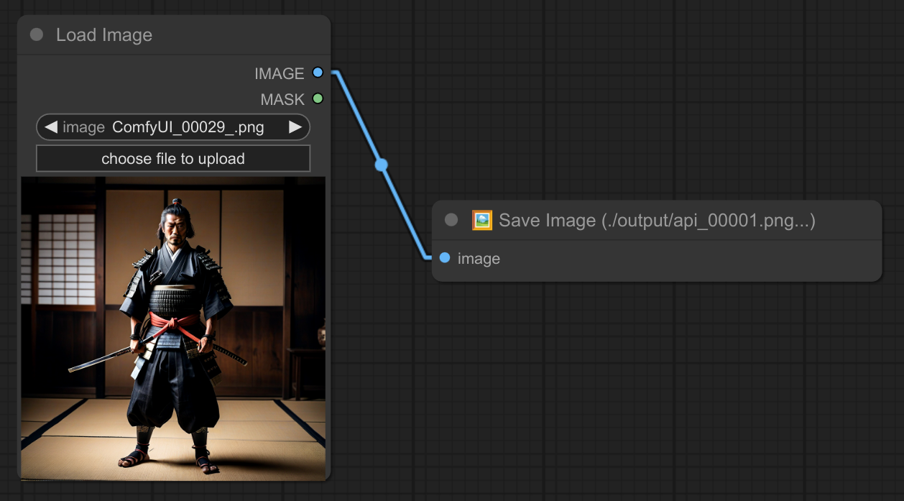

# 🔗 Comfyui : Bjornulf_custom_nodes v0.5 🔗

# Dependencies

- `pip install ollama` (you can also install ollama if you want :  https://ollama.com/download) - You don't need to really install it if you don't want to use my ollama node. (BUT you need to run `pip install ollama`)

# 📝 Changelog

- **v0.2**: Improve ollama node with system prompt + model selection.
- **v0.3**: Add a new node : Save image to a chosen folder.
- **v0.3**: Add comfyui Metadata / workflow to all my image-related nodes.
- **v0.4**: Support transparency option with webm format, options encoders. As well as input for audio stream. 
- **v0.5**: New node : Remove image transparency (alpha) - Fill alpha channel with solid color.
- **v0.5**: New node : Image to grayscale (black & white) - Convert an image to grayscale.

# 📝 Nodes descriptions

## 1/2 - 👁 + ✒ Show/Write Text 

**Description:**  
Two simple nodes to write and show text.
Write node is a textarea where you can write your text.  
The show text node will only display the text. (That's why I made it a different color : green, uneditable, display only.)

## 3 - 🔗 Combine Texts

**Description:**  
Combine multiple text inputs into a single output. (can have separation with : comma, space, new line.)

## 4 - 🎲 Random Text

**Description:**  
Generate and display random text from a predefined list. Great for creating random prompts.

## 5 - ♻ Loop

**Description:**  
General-purpose loop node.

## 6 - ♻ Loop Texts

**Description:**  
Cycle through a list of text inputs. Great for creating dynamic text-based presentations.

## 7 - ♻ Loop Integer

**Description:**  
Iterate through a range of integer values, good for `steps` in ksampler, etc...

❗ Don't forget that you can convert ksampler widgets to input by right-clicking the ksampler node :

## 8 - ♻ Loop Float

**Description:**  
Loop through a range of floating-point numbers, good for `cfg`, `denoise`, etc...

## 10 - ♻ Loop All Samplers

**Description:**  
Iterate over all available samplers to apply them sequentially. Ideal for testing.

## 11 - ♻ Loop All Schedulers

**Description:**  
Iterate over all available schedulers to apply them sequentially. Ideal for testing.

## 12 - ♻ Loop Combos

**Description:**  
Generate a loop from a list of my own custom combinations (scheduler+sampler), or select one combo manually.  
Good for testing.

## 13/14 - 📏 + 🖼 Resize and Save Exact name ⚠️💣

**Description:**  
Resize an image to exact dimensions. The other node will save the image to the exact path.  
⚠️💣 Warning : The image will be overwritten if it already exists.

## 15 - 💾 Save Text

**Description:**  
Save the given text input to a file. Useful for logging and storing text data.

## 16 - 🖼 Save image for API (❗For my custom [lobe-chat](https://github.com/justUmen/lobe-chat)❗)

**Description:**  
It will save the image with the name of `api_next_image.txt`, which will be incremented each time you run the node.  
The name will start at `api_00001.png`, then `api_00002.png`, etc...  
❓ I made that for my custom lobe-chat to send+receive images from Comfyui API : [lobe-chat](https://github.com/justUmen/lobe-chat)

## 17 - 🖼 Save image as `tmp_api.png` Temporary API ⚠️💣

**Description:**  
Save image for short-term use : ./output/tmp_api.png ⚠️💣

## 18 - 🖼📁 Save image to a chosen folder name

**Description:**  
Save image in a specific folder : `my_folder/00001.png`, `my_folder/00002.png`, etc...  
Also allow multiple nested folders, like for example : `animal/dog/small`.

## 19 - 🦙 Ollama

**Description:**  
Will generate detailed text based of what you give it.  
I recommend using `mistral-nemo` if you can run it, but it's up to you. (Might have to tweak the system prompt a bit)  
⚠️ Warning : Having an ollama node that will run for each generation might be a bit heavy on your VRAM. Think about if you really need it or not.

**Description:**  
Straight forward node to write and show text.

## 20 - 📹 Video Ping Pong

**Description:**  
Create a ping-pong effect from a list of images (from a video) by reversing the playback direction when reaching the last frame. Good for an "infinity loop" effect.

## 21 - 📹 Images to Video

**Description:**  
Combine a sequence of images into a video file.  
❓ I made this node because it supports transparency with webm format. (Needed for rembg)  
Temporary images are stored in the folder `ComfyUI/temp_images_imgs2video/` as well as the wav audio file.

## 22 - 🔲 Remove image Transparency (alpha)

**Description:**  
Remove transparency from an image by filling the alpha channel with a solid color. (black, white or greenscreen)  
Of course it takes in an image with transparency, like from rembg nodes.  
Necessary for some nodes that don't support transparency.  

## 23 - 🔲 Image to grayscale (black & white)

**Description:**  
Convert an image to grayscale (black & white)  
Example : I sometimes use it with Ipadapter to disable color influence.  
But you can sometimes also want a black and white image...  